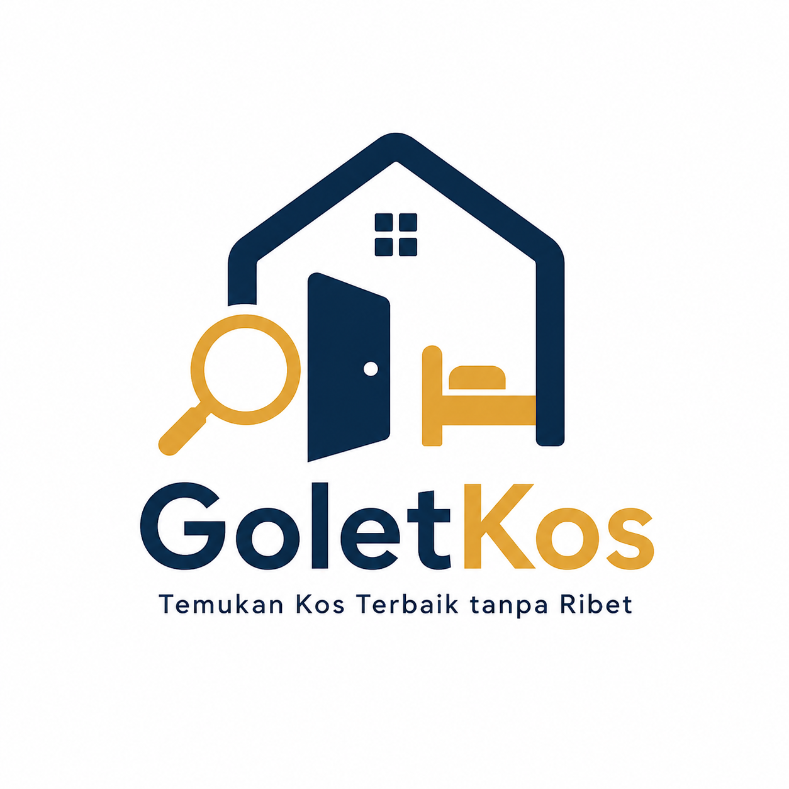

# GoletKos

Temukan Kos Terbaik tanpa Ribet

  

---

## Deskripsi

GoletKos adalah platform aplikasi berbasis web yang membantu pengguna dalam mencari kos berdasarkan berbagai kriteria seperti lokasi, harga, dan fasilitas. Selain itu, GoletKos dilengkapi dengan fitur perbandingan kos yang memungkinkan pengguna membandingkan beberapa pilihan secara langsung, sehingga mempermudah dalam menentukan kos terbaik secara lebih efektif.

Aplikasi ini dirancang tidak hanya sebagai alat pencarian, tetapi juga sebagai sistem pendukung keputusan sederhana yang membantu pengguna dalam memilih kos yang paling sesuai dengan kebutuhan mereka.

---

## Role Pengguna

### Pencari Kos (User)

Pengguna yang mencari dan membandingkan kos.

Fitur:

* Registrasi dan login
* Pencarian kos berdasarkan lokasi, harga, dan fasilitas
* Melihat detail kos (foto, fasilitas, harga, deskripsi)
* Menyimpan kos (wishlist)
* Membandingkan beberapa kos (compare)
* Mendapatkan rekomendasi kos
* Melakukan booking
* Melihat riwayat booking

---

### Pemilik Kos (Owner)

Pengguna yang mengelola dan menawarkan kos.

Fitur:

* Registrasi dan login
* Menambahkan data kos
* Mengelola data kos (edit informasi, harga, fasilitas, dan foto)
* Melihat daftar booking
* Mengelola status booking (pending, confirmed, completed, cancelled)
* Melihat statistik sederhana (jumlah booking, kos yang diminati)

---

## Fitur Utama

### Perbandingan Kos (Compare)

* Memilih beberapa kos sekaligus
* Menampilkan perbandingan dalam bentuk tabel
* Membandingkan harga, fasilitas, lokasi, dan rating
* Menampilkan perbedaan utama antar kos

---

### Decision Score

* Memberikan skor pada setiap kos berdasarkan:

  * Harga
  * Fasilitas
  * Lokasi
  * Rating
* Menyediakan rekomendasi kos terbaik

---

### Estimasi Biaya Hidup

* Menghitung estimasi biaya per bulan yang meliputi:

  * Harga kos
  * Listrik
  * Air
  * Internet
* Menyajikan total estimasi pengeluaran

---

### Rekomendasi Kos

* Memberikan rekomendasi berdasarkan preferensi pengguna:

  * Budget
  * Fasilitas
  * Lokasi

---

### Status Booking

* Mengatur alur status booking:

  * Pending → Confirmed → Completed
  * Pending → Cancelled

---

## Tech Stack

* Frontend: HTML, CSS, JavaScript
* Backend: Node.js (Express.js)
* Database: MySQL
* Tools: GitHub, Postman, Jest

---

## Struktur Data

### Entitas:

* User
* Kos
* Fasilitas
* Booking

### Relasi:

* User dapat melakukan booking
* Kos memiliki banyak fasilitas
* Pemilik kos mengelola banyak kos
* Booking menghubungkan User dengan Kos

---

## Teknik Konstruksi Perangkat Lunak

Setiap anggota tim menerapkan dua teknik konstruksi perangkat lunak sesuai dengan ketentuan tugas.

### Pembagian Teknik per Anggota

| Nama   | Teknik 1                    | Teknik 2              |
| ------ | --------------------------- | --------------------- |
| Davis  | API                         | Runtime Configuration |
| Daffa  | Table-driven Construction   | Code Reuse / Library  |
| Tony   | Parameterization / Generics | Code Reuse / Library  |
| Rafael | Automata                    | Runtime Configuration |

---

### Implementasi Teknik

#### API

Digunakan untuk komunikasi antara frontend dan backend, seperti endpoint:

* GET /kos
* POST /booking
* POST /login

---

#### Runtime Configuration

Digunakan untuk pengaturan sistem yang dapat diubah tanpa mengubah kode, seperti konfigurasi port server, koneksi database, dan environment variables.

---

#### Code Reuse / Library

Digunakan untuk meningkatkan efisiensi pengembangan melalui penggunaan ulang kode, seperti helper function, middleware, serta pemanfaatan library seperti Express.js.

---

#### Table-driven Construction

Digunakan dalam pengolahan data berbasis tabel atau mapping, seperti pemetaan fasilitas dan penyajian data pada fitur perbandingan kos.

---

#### Automata

Digunakan untuk mengatur alur status booking secara terstruktur agar perubahan status mengikuti urutan yang valid.

---

#### Parameterization / Generics

Digunakan untuk membuat fungsi yang bersifat fleksibel dan reusable, khususnya dalam pengolahan data dengan tipe yang berbeda.

---

## Tujuan Pengembangan

GoletKos dikembangkan untuk:

* Mempermudah proses pencarian kos
* Mengurangi kompleksitas dalam memilih kos
* Menyediakan fitur perbandingan yang informatif
* Mendukung pengambilan keputusan secara cepat dan tepat
* Menyediakan platform bagi pemilik kos untuk mengelola properti mereka

---

## Status Proyek

Dalam tahap pengembangan sebagai bagian dari Tugas Besar Konstruksi Perangkat Lunak.

---

## Tim Pengembang

* [Davis : 103122400034 
* Daffa : 103122400029
* Rafael: 103122400015
* Tony  : 103122400021

---

## Lisensi

Proyek ini dikembangkan untuk kebutuhan wajib tugas mata kuliah.
